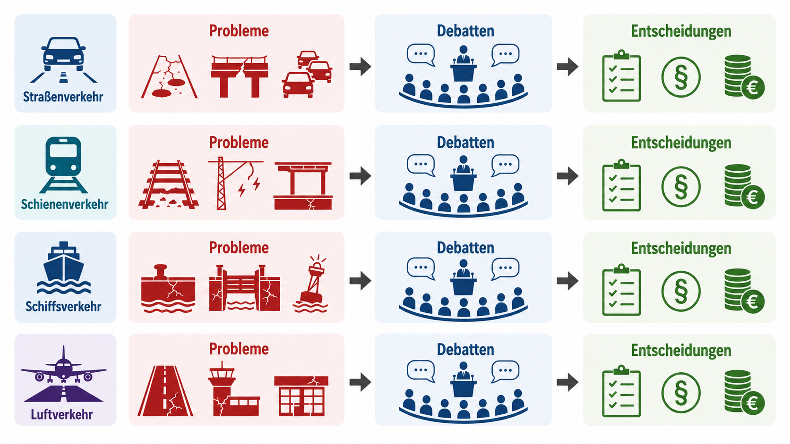

```{r setup, include=FALSE}
library(tidyverse)
library(zoo)
library(plotly)
library(traffic)

bt_corp <- read_rds("/Users/jan/Documents/Datensätze/Projekt IHK/coded_df_full.rds")

bt_corp_filtered <- bt_corp %>%
  filter(chair == FALSE) %>%
  mutate(
    date       = as.Date(date),
    year       = year(date),
    month      = month(date),
    year_month = floor_date(date, "month"),
    lp         = as.integer(lp)
  )

transportation_speeches <- traffic::transportation_speeches_final %>%
  mutate(
    words_Straße          = share_Straße          * words_speech,
    words_Schiene         = share_Schiene         * words_speech,
    words_Schiff          = share_Schiff          * words_speech,
    words_Luft            = share_Luft            * words_speech,
    words_Güterverkehr    = share_Güterverkehr    * words_speech,
    words_Personenverkehr = share_Personenverkehr * words_speech
  )
```

## Erkenntnisinteresse

- Wie werden Verkehrsthemen als politische Probleme wahrgenommen?
- Warum kommt die Politik selten zu Lösungen trotz Problemidentifizierung?
- Arena: Bundestagsplenardebatten seit der Wiedervereinigung (1991–2025)
- Ziel: Agenda-Setting-Prozesse empirisch und im Zeitverlauf sichtbar machen

## Grundmodell

::: {style="display: flex; align-items: center; justify-content: center; height: 620px;"}
{style="max-width: 100%; max-height: 620px; object-fit: contain;"}
:::


## Theoretischer Rahmen: Agenda Setting

- Agenda Setting = Selektionsprozess: begrenzte Aufmerksamkeit wird auf wenige Probleme verteilt (Jones & Baumgartner 2005; Zahariadis 2025)
- Nicht linear, sondern von Debattendynamiken geprägt
- Drei Ebenen der Agenda:
  - **Institutionelle Agenda** — Thema erreicht die Plenardebatte *(unsere Defaultebene)*
  - **Entscheidungsagenda** — konkreter Vorschlag / Abstimmung
  - **Formalentscheidung** — Output des Prozesses
- Übergänge = kritische Wegmarken (*critical junctures*), die Gestaltungsfähigkeit erfordern

## Wie Themen Schwellen überschreiten

Vier Faktoren (Birkland 2025; vgl. Shivakoti & Howlett 2022):

- **Politische Führung** — aktive Gestaltung; *mobilization of bias* zugunsten gut organisierter Interessen
- **Fokussierende Ereignisse** — Krisen, Unglücke erzeugen Handlungsdruck
- **Indikatorenänderungen** — veränderte Messwerte (z. B. Stauatlas)
- **Wahlergebnisse** — Policy-Bilanz, neue Machtarithmetik (auch Bundesrat)

## Datengrundlage & Identifikation der Reden

- Korpus: **GermaParl** (Bundestagsplenarprotokolle)
- Verkehrsreden identifiziert mit **parlbert-topic-german** (Codebuch: Comparative Agendas Project)
- Kategorie „Transportation": **F1 = 0,86** → zuverlässig
- Klassifikation auf **3-Satz-Fenstern**, anschließend Aggregation auf Redeebene
- Gewichtung über **Wortanteile** statt reiner Redenzahl

## Feinklassifikation: Verkehrsträger & Verkehrsart

- Zwei Dimensionen pro Ausschnitt:
  - **Verkehrsart:** Personen- vs. Güterverkehr
  - **Verkehrsträger:** Straße · Schiene · Schiff · Luft
- Trainingsdaten erzeugt per LLM (**Anthropic Claude Sonnet 4**)
  - LLMs ≈ menschliche Kodierer:innen bei guten Prompts (Halterman & Keith 2026 u. a.)
  - Vorstrukturierung: Diktionär-Treffer + Zufallsstichprobe (je 1.500 Ausschnitte)
- Feintuning von **ModernGBERT 1B** (bestes frei verfügbares dt. Modell, Uni Würzburg)

## Modellgüte (Testset)

- **Verkehrsträger:** micro-F1 0,94 · macro-F1 0,95
  - Straße 0,95 · Schiene 0,93 · Schiff 0,94 · Luft 0,97
- **Verkehrsart:** micro-F1 0,86 · macro-F1 0,86
  - Güterverkehr 0,90 · Personenverkehr 0,82
- → zuverlässige Erkennung, gerade nach Aggregation auf Redeebene

## Themenkonjunktur der Verkehrspolitik

```{r, echo=FALSE, message=FALSE, warning=FALSE, out.width="100%"}
lp_starts <- bt_corp %>%
  group_by(lp) %>%
  summarise(start = min(date), .groups = "drop")

transport_monthly <- bt_corp_filtered %>%
  group_by(year_month, lp) %>%
  summarise(
    words_transport      = sum(words_speech[
      Transportation_dominant == TRUE |
      share_Transportation >= 0.3333 |
      n_Transportation >= 15
    ], na.rm = TRUE),
    words_total          = sum(words_speech, na.rm = TRUE),
    word_share_transport = words_transport / words_total * 100,
    .groups = "drop"
  )

german_months <- c("Januar", "Februar", "März", "April", "Mai", "Juni",
                   "Juli", "August", "September", "Oktober", "November", "Dezember")

transport_monthly_plot <- transport_monthly %>%
  mutate(tooltip_text = paste0(
    german_months[month(year_month)], " ", year(year_month), "\n",
    gsub("\\.", ",", format(round(word_share_transport, 1), nsmall = 1)), "%"
  ))

loess_fit <- loess(word_share_transport ~ as.numeric(year_month),
                   data = transport_monthly_plot, span = 0.15)
transport_monthly_plot <- transport_monthly_plot %>%
  mutate(loess_y = predict(loess_fit))

lp_shapes <- map(seq_len(nrow(lp_starts)), \(i) list(
  type = "line",
  x0 = lp_starts$start[i], x1 = lp_starts$start[i],
  y0 = 0, y1 = 1, yref = "paper",
  line = list(color = "gray50", dash = "dash", width = 1)
))

lp_annotations <- map(seq_len(nrow(lp_starts)), \(i) list(
  x = lp_starts$start[i], y = 1, yref = "paper",
  text = paste0("LP ", lp_starts$lp[i]),
  showarrow = FALSE,
  xanchor = "left", yanchor = "top",
  font = list(color = "gray40", size = 11)
))

plot_ly(transport_monthly_plot, x = ~year_month) |>
  add_trace(
    y              = ~word_share_transport,
    type           = "scatter",
    mode           = "lines",
    line           = list(color = "steelblue", width = 1),
    name           = "Monatswert",
    hovertemplate  = ~paste0(tooltip_text, "<extra></extra>")
  ) |>
  add_trace(
    y         = ~loess_y,
    type      = "scatter",
    mode      = "lines",
    line      = list(color = "darkblue", width = 2),
    name      = "Trend",
    hoverinfo = "none"
  ) |>
  layout(
    xaxis       = list(title = ""),
    yaxis       = list(title = "Anteil Verkehr (%)", ticksuffix = "%"),
    hovermode   = "x unified",
    shapes      = lp_shapes,
    annotations = lp_annotations,
    legend      = list(orientation = "h", y = -0.15),
    margin      = list(t = 10),
    width       = 1200,
    height      = 560,
    autosize    = FALSE
  )
```

## Verkehrsträger im Zeitverlauf

```{r, echo=FALSE, message=FALSE, warning=FALSE, out.width="100%"}
traeger_vars   <- c("Straße", "Schiene", "Schiff", "Luft")
traeger_farben <- c(
  Straße  = "#E64B35",
  Schiene = "#4DBBD5",
  Schiff  = "#00A087",
  Luft    = "#F39B7F"
)

lp_starts_vt <- transportation_speeches %>%
  group_by(lp) %>%
  summarise(start = min(as.Date(date)), .groups = "drop")

german_months_vt <- c("Januar", "Februar", "März", "April", "Mai", "Juni",
                      "Juli", "August", "September", "Oktober", "November", "Dezember")

make_word_share_expr <- function(cat) {
  words_var <- sym(paste0("words_", cat))
  set_names(
    list(expr(sum(!!words_var, na.rm = TRUE) / words_total)),
    paste0("word_share_", cat)
  )
}

traeger_word_exprs <- traeger_vars |> map(make_word_share_expr) |> list_flatten()

traeger_monthrank <- transportation_speeches |>
  mutate(year_month = floor_date(as.Date(date), "month")) |>
  group_by(year_month) |>
  summarise(
    words_total = sum(words_speech, na.rm = TRUE),
    !!!traeger_word_exprs,
    .groups = "drop"
  ) |>
  select(year_month, starts_with("word_share_")) |>
  pivot_longer(
    cols         = starts_with("word_share_"),
    names_to     = "traeger",
    names_prefix = "word_share_",
    values_to    = "word_share"
  )

traeger_long <- traeger_monthrank |>
  mutate(
    share        = word_share * 100,
    tooltip_text = paste0(
      german_months_vt[month(year_month)], " ", year(year_month), "\n",
      traeger, ": ", gsub("\\.", ",", format(round(share, 1), nsmall = 1)), "%"
    )
  )

lp_shapes_vt <- map(seq_len(nrow(lp_starts_vt)), \(i) list(
  type = "line",
  x0   = lp_starts_vt$start[i], x1 = lp_starts_vt$start[i],
  y0   = 0, y1 = 1, yref = "paper",
  line = list(color = "gray50", dash = "dash", width = 1)
))

lp_annotations_vt <- map(seq_len(nrow(lp_starts_vt)), \(i) list(
  x         = lp_starts_vt$start[i], y = 1, yref = "paper",
  text      = paste0("LP ", lp_starts_vt$lp[i]),
  showarrow = FALSE,
  xanchor   = "left", yanchor = "top",
  font      = list(color = "gray40", size = 11)
))

fig_vt <- plot_ly()

for (tr in traeger_vars) {
  df_tr    <- traeger_long %>% filter(traeger == tr)
  loess_tr <- loess(share ~ as.numeric(year_month), data = df_tr, span = 0.25)
  df_tr    <- df_tr %>% mutate(loess_y = predict(loess_tr))
  farbe    <- traeger_farben[[tr]]

  fig_vt <- fig_vt %>%
    add_trace(
      data          = df_tr, x = ~year_month, y = ~share,
      type          = "scatter", mode = "lines",
      line          = list(color = farbe, width = 1, dash = "dot"),
      name          = tr, legendgroup = tr, showlegend = TRUE,
      hovertemplate = ~paste0(tooltip_text, "<extra></extra>")
    ) %>%
    add_trace(
      data        = df_tr, x = ~year_month, y = ~loess_y,
      type        = "scatter", mode = "lines",
      line        = list(color = farbe, width = 2),
      name        = paste0(tr, " (Trend)"),
      legendgroup = tr, showlegend = FALSE, hoverinfo = "none"
    )
}

fig_vt %>%
  layout(
    xaxis       = list(title = ""),
    yaxis       = list(title = "Anteil am Verkehrsdiskurs (%)", ticksuffix = "%"),
    hovermode   = "x unified",
    shapes      = lp_shapes_vt,
    annotations = lp_annotations_vt,
    legend      = list(orientation = "h", y = -0.15),
    margin      = list(t = 10),
    width       = 1200,
    height      = 560,
    autosize    = FALSE
  )
```

## Verkehrsart: Personenverkehr vs. Güterverkehr

```{r, echo=FALSE, message=FALSE, warning=FALSE, out.width="100%"}
verkehrsart_vars   <- c("Güterverkehr", "Personenverkehr")
verkehrsart_farben <- c(
  Güterverkehr    = "#3C5488",
  Personenverkehr = "#F39B7F"
)

verkehrsart_word_exprs <- verkehrsart_vars |> map(make_word_share_expr) |> list_flatten()

verkehrsart_monthrank <- transportation_speeches |>
  mutate(year_month = floor_date(as.Date(date), "month")) |>
  group_by(year_month) |>
  summarise(
    words_total = sum(words_speech, na.rm = TRUE),
    !!!verkehrsart_word_exprs,
    .groups = "drop"
  ) |>
  select(year_month, starts_with("word_share_")) |>
  pivot_longer(
    cols         = starts_with("word_share_"),
    names_to     = "verkehrsart",
    names_prefix = "word_share_",
    values_to    = "word_share"
  )

verkehrsart_long <- verkehrsart_monthrank |>
  mutate(
    share        = word_share * 100,
    tooltip_text = paste0(
      german_months_vt[month(year_month)], " ", year(year_month), "\n",
      verkehrsart, ": ", gsub("\\.", ",", format(round(share, 1), nsmall = 1)), "%"
    )
  )

fig_va <- plot_ly()

for (va in verkehrsart_vars) {
  df_va    <- verkehrsart_long %>% filter(verkehrsart == va)
  loess_va <- loess(share ~ as.numeric(year_month), data = df_va, span = 0.25)
  df_va    <- df_va %>% mutate(loess_y = predict(loess_va))
  farbe    <- verkehrsart_farben[[va]]

  fig_va <- fig_va %>%
    add_trace(
      data          = df_va, x = ~year_month, y = ~share,
      type          = "scatter", mode = "lines",
      line          = list(color = farbe, width = 1, dash = "dot"),
      name          = va, legendgroup = va, showlegend = TRUE,
      hovertemplate = ~paste0(tooltip_text, "<extra></extra>")
    ) %>%
    add_trace(
      data        = df_va, x = ~year_month, y = ~loess_y,
      type        = "scatter", mode = "lines",
      line        = list(color = farbe, width = 2),
      name        = paste0(va, " (Trend)"),
      legendgroup = va, showlegend = FALSE, hoverinfo = "none"
    )
}

fig_va %>%
  layout(
    xaxis       = list(title = ""),
    yaxis       = list(title = "Anteil am Verkehrsdiskurs (%)", ticksuffix = "%"),
    hovermode   = "x unified",
    shapes      = lp_shapes_vt,
    annotations = lp_annotations_vt,
    legend      = list(orientation = "h", y = -0.15),
    margin      = list(t = 10),
    width       = 1200,
    height      = 560,
    autosize    = FALSE
  )
```

## Verkehrsträger × Verkehrsart

```{r, echo=FALSE, message=FALSE, warning=FALSE, out.width="100%"}
speeches_traeger <- transportation_speeches |>
  filter(if_any(all_of(paste0("Rede_", traeger_vars)), \(x) x))

lps_all     <- sort(unique(speeches_traeger$lp))
lps_row1    <- lps_all[lps_all %in% 12:16]
lps_row2    <- lps_all[lps_all %in% 17:20]
lps_ordered <- c(lps_row1, lps_row2)
n_cols      <- max(length(lps_row1), length(lps_row2))

lp_heatmaps <- map(lps_ordered, \(l) {
  map_dfr(traeger_vars, \(vt) {
    rede_var <- sym(paste0("Rede_", vt))
    speeches_traeger |>
      filter(lp == l, !!rede_var) |>
      summarise(across(
        all_of(paste0("words_", verkehrsart_vars)),
        \(x) sum(x, na.rm = TRUE) / sum(words_speech, na.rm = TRUE)
      )) |>
      mutate(traeger = vt)
  }) |>
    pivot_longer(
      cols         = starts_with("words_"),
      names_to     = "verkehrsart",
      names_prefix = "words_",
      values_to    = "mean_share"
    ) |>
    group_by(traeger) |>
    mutate(mean_share = mean_share / sum(mean_share, na.rm = TRUE)) |>
    ungroup() |>
    plot_ly(
      x             = ~verkehrsart,
      y             = ~traeger,
      z             = ~round(mean_share * 100, 1),
      type          = "heatmap",
      colorscale    = "Blues",
      reversescale  = FALSE,
      zmin          = 0,
      zmax          = 100,
      showscale     = FALSE,
      text          = ~paste0(round(mean_share * 100, 1), "%"),
      texttemplate  = "%{text}",
      hovertemplate = paste0("LP ", l, " | %{y} → %{x}: %{z:.1f}%<extra></extra>")
    ) |>
    layout(xaxis = list(title = ""), yaxis = list(title = ""))
})

subplot(lp_heatmaps, nrows = 2, shareX = TRUE, shareY = TRUE) |>
  layout(
    annotations = map2(lps_ordered, seq_along(lps_ordered), \(l, i) {
      col <- (i - 1) %% n_cols
      row <- (i - 1) %/% n_cols
      list(
        text      = paste0("LP ", l),
        x         = (col + 0.5) / n_cols,
        y         = 1 - row * 0.5 + 0.02,
        xref      = "paper", yref = "paper",
        showarrow = FALSE,
        font      = list(size = 11)
      )
    }),
    margin   = list(t = 45, b = 5, l = 5, r = 5),
    width    = 1200,
    height   = 500,
    autosize = FALSE
  )
```

## Debattenvolumen vs. Verkehrsleistung (Güterverkehr)

```{r, echo=FALSE, message=FALSE, warning=FALSE, out.width="100%"}
vl_gv <- read_csv2("docs/verkehrsleistung_gueterverkehr.csv", show_col_types = FALSE) |>
  mutate(across(-Jahr, \(x) as.numeric(sub("%", "", gsub(",", ".", x))))) |>
  pivot_longer(cols = -Jahr, names_to = "Verkehrsträger", values_to = "Prozent") |>
  mutate(traeger = recode(Verkehrsträger,
    "Straßenverkehr"  = "Straße",
    "Schienenverkehr" = "Schiene",
    "Schiffsverkehr"  = "Schiff"
  ))

traeger_gv_vars <- c("Straße", "Schiene", "Schiff")

discourse_gv <- transportation_speeches |>
  filter(Rede_Güterverkehr) |>
  mutate(year = year(as.Date(date))) |>
  filter(year < 2025) |>
  group_by(year) |>
  summarise(
    total_gv = sum(words_speech, na.rm = TRUE),
    across(all_of(paste0("words_", traeger_gv_vars)), \(x) sum(x, na.rm = TRUE)),
    .groups = "drop"
  ) |>
  pivot_longer(
    cols = starts_with("words_"), names_to = "traeger",
    names_prefix = "words_", values_to = "words"
  ) |>
  mutate(share_discourse = words / total_gv * 100)

combined_gv <- discourse_gv |>
  left_join(vl_gv |> select(Jahr, traeger, Prozent), by = c("year" = "Jahr", "traeger")) |>
  rename(share_verkehrsleistung = Prozent)

lp_year_shapes <- map(seq_len(nrow(lp_starts_vt)), \(i) list(
  type = "line",
  x0 = year(lp_starts_vt$start[i]), x1 = year(lp_starts_vt$start[i]),
  y0 = 0, y1 = 1, yref = "paper",
  line = list(color = "gray50", dash = "dash", width = 1)
))

lp_year_annots <- map(seq_len(nrow(lp_starts_vt)), \(i) list(
  x = year(lp_starts_vt$start[i]), y = 1, yref = "paper",
  text = paste0("LP ", lp_starts_vt$lp[i]),
  showarrow = FALSE, xanchor = "left", yanchor = "top",
  font = list(color = "gray40", size = 11)
))

fig_gv <- plot_ly()

for (tr in traeger_gv_vars) {
  df_tr <- combined_gv |> filter(traeger == tr)
  farbe <- traeger_farben[[tr]]

  fig_gv <- fig_gv |>
    add_trace(
      data = df_tr, x = ~year, y = ~share_discourse,
      type = "scatter", mode = "lines+markers",
      line = list(color = farbe, width = 2, dash = "solid"),
      marker = list(color = farbe, size = 5),
      name = paste0(tr, " (Diskurs)"), legendgroup = tr,
      hovertemplate = paste0(tr, " Diskurs %{x}: %{y:.1f}%<extra></extra>")
    ) |>
    add_trace(
      data = df_tr, x = ~year, y = ~share_verkehrsleistung,
      type = "scatter", mode = "lines+markers",
      line = list(color = farbe, width = 2, dash = "dash"),
      marker = list(color = farbe, size = 5, symbol = "square"),
      name = paste0(tr, " (Verkehrsleistung)"), legendgroup = tr,
      hovertemplate = paste0(tr, " Verkehrsleistung %{x}: %{y:.1f}%<extra></extra>")
    )
}

fig_gv |>
  layout(
    xaxis       = list(title = ""),
    yaxis       = list(title = "Anteil (%)", ticksuffix = "%"),
    hovermode   = "x unified",
    shapes      = lp_year_shapes,
    annotations = lp_year_annots,
    legend      = list(orientation = "h", y = -0.22),
    margin      = list(t = 10, b = 70),
    width       = 1200,
    height      = 480,
    autosize    = FALSE
  )
```

## Debattenvolumen vs. Verkehrsleistung (Personenverkehr)

```{r, echo=FALSE, message=FALSE, warning=FALSE, out.width="100%"}
vl_pv <- read_csv2("docs/verkehrsleistung_personenverkehr.csv", show_col_types = FALSE) |>
  filter(Verkehrsträger %in% c("Straßenverkehr", "Schienenverkehr", "Luftverkehr")) |>
  mutate(traeger = recode(Verkehrsträger,
    "Straßenverkehr"  = "Straße",
    "Schienenverkehr" = "Schiene",
    "Luftverkehr"     = "Luft"
  ))

traeger_pv_vars <- c("Straße", "Schiene", "Luft")

discourse_pv <- transportation_speeches |>
  filter(Rede_Personenverkehr) |>
  mutate(year = year(as.Date(date))) |>
  filter(year < 2025) |>
  group_by(year) |>
  summarise(
    total_pv = sum(words_speech, na.rm = TRUE),
    across(all_of(paste0("words_", traeger_pv_vars)), \(x) sum(x, na.rm = TRUE)),
    .groups = "drop"
  ) |>
  pivot_longer(
    cols = starts_with("words_"), names_to = "traeger",
    names_prefix = "words_", values_to = "words"
  ) |>
  mutate(share_discourse = words / total_pv * 100)

combined_pv <- discourse_pv |>
  left_join(vl_pv |> select(Jahr, traeger, Prozent), by = c("year" = "Jahr", "traeger")) |>
  rename(share_verkehrsleistung = Prozent)

fig_pv <- plot_ly()

for (tr in traeger_pv_vars) {
  df_tr <- combined_pv |> filter(traeger == tr)
  farbe <- traeger_farben[[tr]]

  fig_pv <- fig_pv |>
    add_trace(
      data = df_tr, x = ~year, y = ~share_discourse,
      type = "scatter", mode = "lines+markers",
      line = list(color = farbe, width = 2, dash = "solid"),
      marker = list(color = farbe, size = 5),
      name = paste0(tr, " (Diskurs)"), legendgroup = tr,
      hovertemplate = paste0(tr, " Diskurs %{x}: %{y:.1f}%<extra></extra>")
    ) |>
    add_trace(
      data = df_tr, x = ~year, y = ~share_verkehrsleistung,
      type = "scatter", mode = "lines+markers",
      line = list(color = farbe, width = 2, dash = "dash"),
      marker = list(color = farbe, size = 5, symbol = "square"),
      name = paste0(tr, " (Verkehrsleistung)"), legendgroup = tr,
      hovertemplate = paste0(tr, " Verkehrsleistung %{x}: %{y:.1f}%<extra></extra>")
    )
}

fig_pv |>
  layout(
    xaxis       = list(title = ""),
    yaxis       = list(title = "Anteil (%)", ticksuffix = "%"),
    hovermode   = "x unified",
    shapes      = lp_year_shapes,
    annotations = lp_year_annots,
    legend      = list(orientation = "h", y = -0.22),
    margin      = list(t = 10, b = 70),
    width       = 1200,
    height      = 480,
    autosize    = FALSE
  )
```

## Zwischenfazit Indikatorenänderungen und Debatten

- Abgleich mit **Modal Split** (reale Verkehrsleistung) und **ADAC-Staudaten**
- Befund: **Entkopplung** von Indikatoren und Diskurs
- Die realen Anteile verlaufen träge, der Diskurs fluktuiert stark.
- Die Schiene erhält als politisch gewünschter Alternativträger in der Mobilitätswende weit mehr Aufmerksamkeit, als ihr realer Anteil nahelegt
- Diskurs folgt stärker fokussierenden Ereignissen und Reformdebatten, nicht dem Status quo

## Fokussierende Ereignisse: Zeitstrahl

<iframe src="verkehrsdebatte_themen.html"
        style="width:1200px; height:580px; border:none;"
        scrolling="yes">
</iframe>

## Debattenvolumen vs. Output (Anteil Einzelplan 12)

```{r, echo=FALSE, message=FALSE, warning=FALSE, out.width="100%"}
transport_yearly <- bt_corp_filtered %>%
  group_by(year) %>%
  summarise(
    words_transport      = sum(
      words_speech[
        Transportation_dominant == TRUE |
        share_Transportation >= 0.3333 |
        n_Transportation >= 15
      ], na.rm = TRUE
    ),
    words_total          = sum(words_speech, na.rm = TRUE),
    word_share_transport = words_transport / words_total * 100,
    .groups = "drop"
  )

anteil_epl12 <- read_csv2(
  "/Users/jan/Documents/Datensätze/Projekt IHK/Drittvariablen/anteil_ep12.csv"
)

transport_yearly3 <- left_join(transport_yearly, anteil_epl12, by = c("year" = "jahr")) %>%
  select(year, word_share_transport, soll_anteil_gesamthaushalt, ist_anteil_gesamthaushalt)

plot_ly(transport_yearly3 %>% filter(year < 2025), x = ~year) |>
  add_trace(
    y             = ~word_share_transport,
    type          = "scatter", mode = "lines+markers",
    name          = "Redeanteil",
    line          = list(color = "steelblue", width = 2),
    marker        = list(color = "steelblue", size = 5),
    hovertemplate = ~paste0(year, "<br>Redeanteil: ",
                            gsub("\\.", ",", format(round(word_share_transport, 1), nsmall = 1)),
                            "%<extra></extra>")
  ) |>
  add_trace(
    y             = ~soll_anteil_gesamthaushalt,
    type          = "scatter", mode = "lines+markers",
    name          = "Soll-Anteil EP 12",
    line          = list(color = "darkorange", width = 2, dash = "dash"),
    marker        = list(color = "darkorange", size = 5),
    hovertemplate = ~paste0(year, "<br>Soll-Anteil: ",
                            gsub("\\.", ",", format(round(soll_anteil_gesamthaushalt, 1), nsmall = 1)),
                            "%<extra></extra>")
  ) |>
  add_trace(
    y             = ~ist_anteil_gesamthaushalt,
    type          = "scatter", mode = "lines+markers",
    name          = "Ist-Anteil EP 12",
    line          = list(color = "darkgreen", width = 2, dash = "dot"),
    marker        = list(color = "darkgreen", size = 5),
    hovertemplate = ~paste0(year, "<br>Ist-Anteil: ",
                            gsub("\\.", ",", format(round(ist_anteil_gesamthaushalt, 1), nsmall = 1)),
                            "%<extra></extra>")
  ) |>
  layout(
    xaxis       = list(title = "", dtick = 2, tickangle = -45),
    yaxis       = list(title = "Anteil (%)", ticksuffix = "%"),
    hovermode   = "x unified",
    legend      = list(orientation = "h", y = -0.18),
    margin      = list(t = 10, b = 55),
    width       = 1200,
    height      = 510,
    autosize    = FALSE
  )
```

## Debattenvolumen vs. Ist-Ausgaben Bund

```{r, echo=FALSE, message=FALSE, warning=FALSE, out.width="100%"}
traeger_yearrank <- transportation_speeches |>
  mutate(year = year(as.Date(date))) |>
  filter(year < 2025) |>
  group_by(year) |>
  summarise(
    across(
      all_of(paste0("words_", traeger_vars)),
      \(x) sum(x, na.rm = TRUE) / sum(words_speech, na.rm = TRUE)
    ),
    .groups = "drop"
  ) |>
  rename_with(~ sub("^words_", "word_share_", .), starts_with("words_")) |>
  pivot_longer(
    cols         = starts_with("word_share_"),
    names_to     = "traeger",
    names_prefix = "word_share_",
    values_to    = "word_share"
  )

ausgaben_raw <- read_csv2("docs/ist_ausgaben_bund.csv", show_col_types = FALSE) |>
  select(Jahr, 7:10)
colnames(ausgaben_raw) <- c("Jahr", "Straße", "Schiff", "Schiene", "Luft")

ausgaben_long <- ausgaben_raw |>
  pivot_longer(cols = -Jahr, names_to = "traeger", values_to = "share_ausgaben")

combined_ausgaben <- traeger_yearrank |>
  mutate(share_discourse = word_share * 100) |>
  left_join(ausgaben_long, by = c("year" = "Jahr", "traeger"))

ausgaben_label <- c(
  Straße  = "Bundesfernstraßen",
  Schiff  = "Bundeswasserstraßen",
  Schiene = "Eisenbahnen",
  Luft    = "Luftfahrt"
)

fig_ausgaben <- plot_ly()

for (tr in traeger_vars) {
  df_tr <- combined_ausgaben |> filter(traeger == tr)
  farbe <- traeger_farben[[tr]]
  label <- ausgaben_label[[tr]]

  fig_ausgaben <- fig_ausgaben |>
    add_trace(
      data = df_tr, x = ~year, y = ~share_discourse,
      type = "scatter", mode = "lines+markers",
      line   = list(color = farbe, width = 2, dash = "solid"),
      marker = list(color = farbe, size = 5),
      name   = paste0(tr, " (Diskurs)"), legendgroup = tr,
      hovertemplate = paste0(tr, " Diskurs %{x}: %{y:.1f}%<extra></extra>")
    ) |>
    add_trace(
      data = df_tr, x = ~year, y = ~share_ausgaben,
      type = "scatter", mode = "lines+markers",
      line   = list(color = farbe, width = 2, dash = "dash"),
      marker = list(color = farbe, size = 5, symbol = "square"),
      name   = paste0(label, " (Ist-Ausgaben)"), legendgroup = tr,
      hovertemplate = paste0(label, " Ist-Ausgaben %{x}: %{y:.1f}%<extra></extra>")
    )
}

fig_ausgaben |>
  layout(
    xaxis       = list(title = ""),
    yaxis       = list(title = "Anteil (%)", ticksuffix = "%"),
    hovermode   = "x unified",
    shapes      = lp_year_shapes,
    annotations = lp_year_annots,
    legend      = list(orientation = "h", y = -0.22),
    margin      = list(t = 10, b = 70),
    width       = 1200,
    height      = 480,
    autosize    = FALSE
  )
```

## Fazit

- **Zentraler Befund:** Der parlamentarische Diskurs ist stark **ereignis- und krisengetrieben** und nur lose an reale Indikatoren gekoppelt
- Fokussierende Ereignisse erklären viele Spitzen, Indikatoren erstaunlich wenig. 
- Der Haushalt folgt langfristigen Investitionszyklen, nicht den kurzfristigen Debattenkonjunkturen